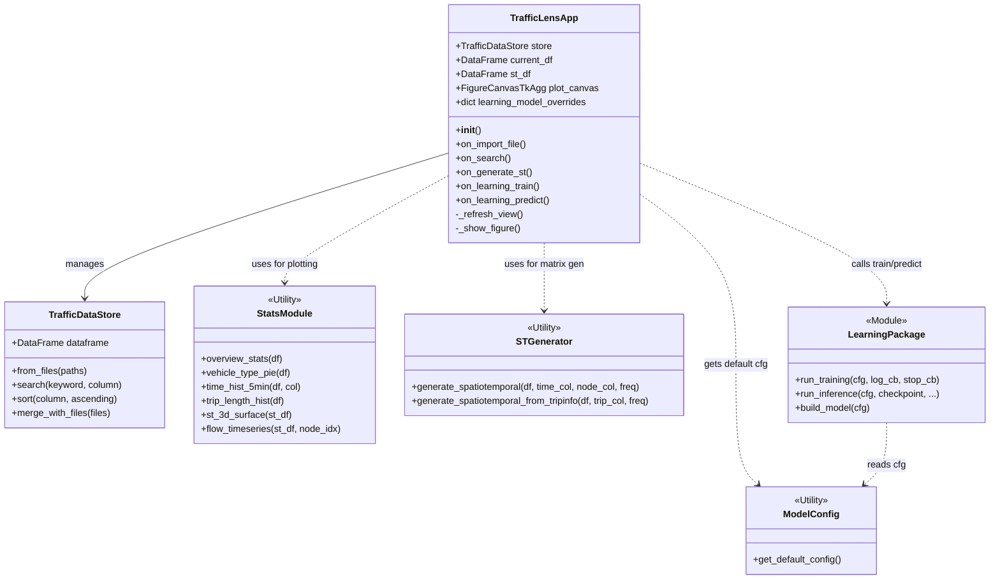

  

# TrafficLens: Desktop Traffic Viewer and Benchmark for Taiwan Highways

**TrafficLens** is a Python-based desktop application designed for analyzing, visualizing, and modeling traffic data. Built with **Tkinter** for the GUI, **pandas** for data manipulation, **Matplotlib** for visualization, and **PyTorch** for deep learning-based traffic flow forecasting. Source: 交通資料庫 (traffic database) of the Freeway Bureau of Taiwan. https://tisvcloud.freeway.gov.tw/history/TDCS/M06ALinks to an external site.

## System Architecture

The system follows a modular design separating GUI, data handling, and analysis logic.

## Key Features

*   **Data Management**: Batch import/merge of CSV files and folders; Export to CSV, XLSX, NPY.
*   **Exploration**: High-performance sorting and keyword searching; Custom filtering.
*   **Visualization**: Interactive charts (Pie, Histogram, Bar) and summary statistics.
*   **Spatio-Temporal (ST) Analysis**: Generate ST matrices from raw logs or trajectory data; 2D/3D visualization.
*   **Deep Learning**: Integrated training and benchmarking for traffic forecasting models (GWNet, LSTM, STGformer).

## Directory Structure

| Directory | Description |
|:---|:---|
| `trafficlens/` | Core GUI and data processing logic (`gui.py` is the controller). |
| `Learning/` | Deep learning module (models, training, prediction). |
| `data/` | Input CSV files. |
| `checkpoint/` | Model checkpoints saved during training. |
| `output_data/` | Prediction outputs. |

## Functional Modules

### 1. File Management
Supports importing individual files or entire folders. When importing folders, files are automatically merged. Includes robust error handling to clear views upon incorrect imports. Data can be exported in **CSV**, **XLSX**, or **NPY** formats.

### 2. Data Operations (Search & Sort)
*   **Sorting**: Utilizes Python's built-in Timsort (efficient for real-world data) backend. Activated by clicking column headers.
*   **Searching**: Supports exact and fuzzy matching across specific or all columns.

### 3. Visualization & Statistics
*   **Filtering**: Interactive value range selection.
*   **Plotting**:
    *   *VehicleType*: Pie charts.
    *   *Time/TripLength*: Frequency histograms.
    *   *GantryID*: Horizontal bar charts for top 30 nodes.

### 4. Spatio-Temporal Analysis
Transforms raw trajectory logs into **Spatio-Temporal (ST) flow matrices**.
*   **Trajectory Processing**: Extracts `(timestamp, gantry)` events from the `TripInformation` field to capture complete path data, not just O/D points.
*   **Visualization**: 3D surface plots representing traffic intensity over time and space, plus 2D trend lines for individual nodes.

### 5. Deep Learning Benchmarks
Built-in environment for benchmarking traffic prediction algorithms on Taiwan highway data.
*   **Models**: [GWNet](https://arxiv.org/abs/1906.00121), **LSTM**, and [STGformer](https://arxiv.org/abs/2410.00385) (enhanced with an adaptive adjacency matrix in this project).
*   **Workflow**:
    1.  Configure hyperparameters (device, window size, early stopping).
    2.  **Train**: Asynchronous background training with real-time log updates.
    3.  **Predict**: Load `.pth` checkpoints to visualize predictions against ground truth.

## Notes on Implementation

### Trajectory-based ST Matrix Generation
In addition to O/D-based matrices, the project can build spatio-temporal matrices from full vehicle trajectories (ordered timestamp–gantry pairs).
*   The implementation splits trajectory strings, extracts events, maps them to discrete time windows, and aggregates counts into a $K \times J$ matrix.

### Handling O/D Time Window Asymmetry
When spatio-temporal matrices are derived from destination times, the number of time bins may differ from those based on origin times because of travel duration.
To keep origin- and destination-based matrices comparable, the destination-based matrix is truncated using the origin time windows as a reference.

### Parallel Loading Strategy for Multiple Files
File I/O for many CSV files is handled with a simple adaptive strategy:
*   **< 8 files**: Serial reading to avoid thread overhead.
*   **≥ 8 files**: Parallel reading using `ThreadPoolExecutor` (max 8 workers).
*   All files are read as string type to skip type inference, and concatenation is done in batches to reduce memory copying.

### Non-blocking GUI for Long-running Tasks
The GUI is kept responsive while training and inference run in the background:
*   **Threading**: Long-running tasks (training, inference) run in daemon threads.
*   **Callbacks**: Thread-safe communication (`log_callback`) updates the UI via `self.after()`.
